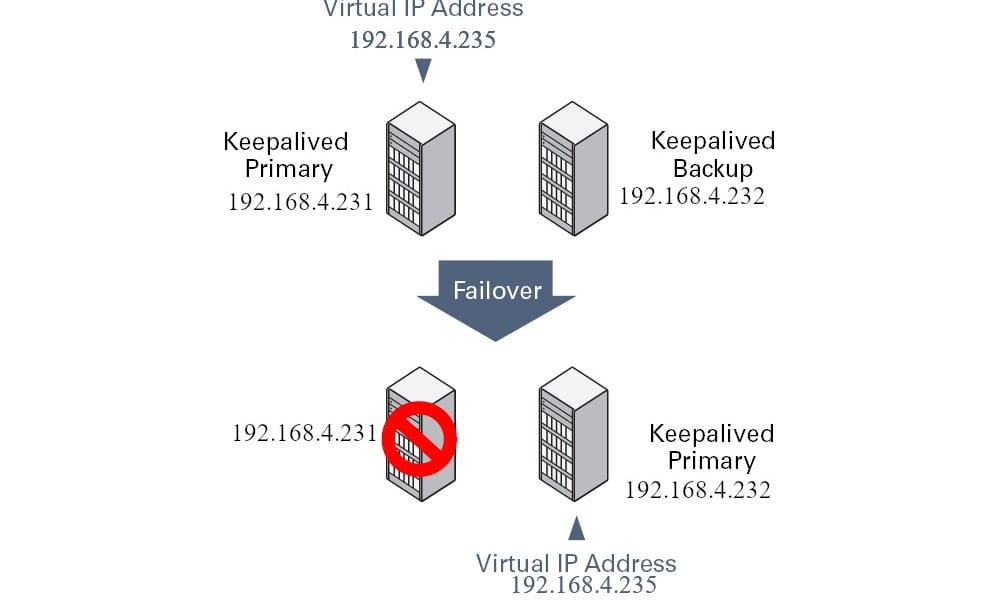

# SFTP (CrushFTP)with HA

<figure><figcaption><p>concept</p></figcaption></figure>

Services to be used&#x20;

* Keepalived
* CrushFTP
* crontab

## CrushFTP

Install CrushFTP using this [tutorial](https://www.crushftp.com/crush11wiki/Wiki.jsp?page=Linux%20Install)

## Setup HA using Keepalived


```
                           /---> SF1 [active]
                          /      |
                         /       |
Service request ----> Virtual IP     (VRRP)
                         .       |
                          .      |
                           . . > SF2 [passive]
```


> Lets configure HA

<table data-full-width="false"><thead><tr><th>Hostname</th><th>IP</th><th>Role</th></tr></thead><tbody><tr><td>SF1</td><td>192.168.4.231</td><td>Master</td></tr><tr><td>SF2</td><td>192.168.4.232</td><td>Slave</td></tr><tr><td>VIP</td><td>192.168.4.235</td><td>VIP</td></tr></tbody></table>

type `ip a`  in terminal to find IP address of you hosts, install below mentioned packages in your servers.&#x20;


```bash
sudo yum update
sudo yum install keepalived
sudo yum install libipset13
```



edit your config, I am using nano as editor because I am using Ubuntu.

```sh
sudo nano /etc/keepalived/keepalived.conf
```

First node

<pre class="language-shell" data-title="/etc/keepalived/keepalived.conf"><code class="lang-shell">vrrp_instance VI_1 {
  state MASTER
  interface <a data-footnote-ref href="#user-content-fn-1">ens192</a>
  virtual_router_id 55
  priority 150
  advert_int 1
  unicast_src_ip 192.168.4.231
  unicast_peer {
    192.168.4.232
  }

  authentication {
    auth_type PASS
    auth_pass <a data-footnote-ref href="#user-content-fn-2">5GK!Ka^4</a>
  }

  virtual_ipaddress {
    192.168.4.235/24
  }
}
</code></pre>

Second node

<pre class="language-sh" data-title="/etc/keepalived/keepalived.conf"><code class="lang-sh">vrrp_instance VI_1 {
  state BACKUP
  interface <a data-footnote-ref href="#user-content-fn-3">ens192</a>
  virtual_router_id 55
  priority 100
  advert_int 1
  unicast_src_ip 192.168.4.232
  unicast_peer {
    192.168.4.231
  }

  authentication {
    auth_type PASS
    auth_pass <a data-footnote-ref href="#user-content-fn-4">5GK!Ka^4</a>
  }

  virtual_ipaddress {
    192.168.4.235/24
  }
}
</code></pre>

Start and enable the service

```sh
sudo systemctl enable --now keepalived.service
```

Stopping the service

<pre class="language-sh"><code class="lang-sh"><strong>sudo systemctl stop keepalived.service
</strong></code></pre>

Starting the service

```sh
sudo systemctl start keepalived.service
```

get the status

```sh
sudo systemctl status keepalived.service
```

[^1]: check your interface name

[^2]: Limit this password to <mark style="color:yellow;">8 characters</mark>, and <mark style="color:yellow;">it must be same in second host</mark> configuration.

[^3]: check your interface name

[^4]: Limit this password to <mark style="color:yellow;">8 characters</mark>, and it must be same in <mark style="color:yellow;">first host configuration.</mark>
