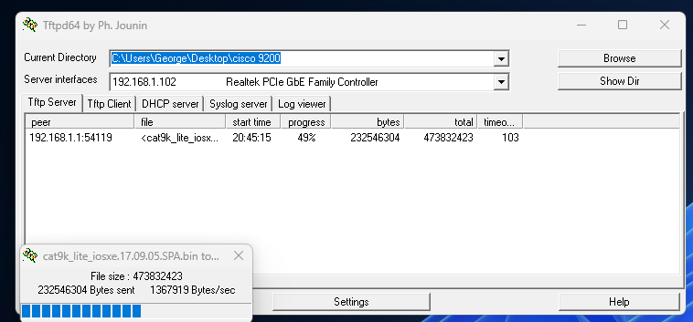

# Upgrade Cisco9200L firmware to recommended

<figure><figcaption><p>Snapshot of Tftp firmware uploading progress.</p></figcaption></figure>


```sh

% Please answer 'yes' or 'no'.
Would you like to enter the initial configuration dialog? [yes/no]: no

  The enable secret is a password used to protect
  access to privileged EXEC and configuration modes.
  This password, after entered, becomes encrypted in
  the configuration.
  -------------------------------------------------
  secret should be of minimum 10 characters and maximum 32 characters with
  at least 1 upper case, 1 lower case, 1 digit and
  should not contain [cisco]
  -------------------------------------------------
  Enter enable secret: ************
  Confirm enable secret: ************

The following configuration command script was created:

enable secret 9 $9$vbYGXLb9egJmn.$DWMm3D2fKTw77mj6Q20UueYVMLDr1u11iDxvWPQoCF.
!
end


[0] Go to the IOS command prompt without saving this config.
[1] Return back to the setup without saving this config.
[2] Save this configuration to nvram and exit.

Enter your selection [2]: 2
Building configuration...
[OK]
Use the enabled mode 'configure' command to modify this configuration.


Press RETURN to get started!


*Apr  1 15:21:03.979: %CRYPTO_ENGINE-5-KEY_ADDITION: A key named TP-self-signed-920611750 has been generated or imported by crypto-engine
*Apr  1 15:21:04.006: %SSH-5-ENABLED: SSH 1.99 has been enabled
*Apr  1 15:21:04.173: %PKI-4-NOCONFIGAUTOSAVE: Configuration was modified.  Issue "write memory" to save new IOS PKI configuration
*Apr  1 15:21:04.177: %SYS-5-CONFIG_P: Configured programmatically by process Setup from console as vty0
*Apr  1 15:21:08.649: %CRYPTO_ENGINE-5-KEY_ADDITION: A key named TP-self-signed-920611750.server has been generated or imported by crypto-engine
*Apr  1 15:21:09.495: %SYS-5-CONFIG_P: Configured programmatically by process PnP Agent Discovery from console as vty0
*Apr  1 15:21:09.525: %SYS-5-CONFIG_P: Configured programmatically by process PnP Agent Discovery from console as vty0
*Apr  1 15:21:09.525: %PNP-6-PNP_DISCOVERY_STOPPED: PnP Discovery stopped (Startup Config Present)
Switch>en
Password:
Switch#conf t
Enter configuration commands, one per line.  End with CNTL/Z.
Switch(config)#interface vlan 1
Switch(config-if)#ip address 192.168.1.1 255.255.255.0
Switch(config-if)#no sh
Switch(config-if)#exit
Switch(config)#interface gigabitethernet 1/0/1
Switch(config-if)#switchport mode access
Switch(config-if)#switchport access vlan 1
Switch(config-if)#no sh
Switch(config-if)#do wr
Building configuration...
[OK]
Switch(config-if)#exit
Switch(config)#exit
Switch#
*Apr  1 15:23:22.518: %SYS-5-CONFIG_I: Configured from console by console
Switch#copy tftp: bootflash:cat9k_lite_iosxe.17.09.05.SPA.bin
Address or name of remote host []? 192.168.1.102
Source filename []? cat9k_lite_iosxe.17.09.05.SPA.bin
Destination filename [cat9k_lite_iosxe.17.09.05.SPA.bin]?
Accessing tftp://192.168.1.102/cat9k_lite_iosxe.17.09.05.SPA.bin...
*Apr  1 15:25:45.999: %LINK-3-UPDOWN: Interface GigabitEthernet1/0/1, changed state to up
*Apr  1 15:25:46.999: %LINEPROTO-5-UPDOWN: Line protocol on Interface GigabitEthernet1/0/1, changed state to up
%Error opening tftp://192.168.1.102/cat9k_lite_iosxe.17.09.05.SPA.bin (Timed out)
Switch#
Switch#copy tftp: bootflash:cat9k_lite_iosxe.17.09.05.SPA.bin
Address or name of remote host [192.168.1.102]?
Source filename [cat9k_lite_iosxe.17.09.05.SPA.bin]?
Destination filename [cat9k_lite_iosxe.17.09.05.SPA.bin]?
Accessing tftp://192.168.1.102/cat9k_lite_iosxe.17.09.05.SPA.bin...
Loading cat9k_lite_iosxe.17.09.05.SPA.bin from 192.168.1.102 (via Vlan1): !
*Apr  1 15:26:17.047: %LINEPROTO-5-UPDOWN: Line protocol on Interface Vlan1, changed state to up!!!!!!!!!!!!!!!!!!!!!!!!!!!!!!!!!!!!!!!!!!!!!!!!!!!!!!!!!!!!!!!!!!!!!!!!!!!!!!!!!!!!!!!!!!!!!!!!!!!!!!!!!!!!!!!!!!!
[OK - 473832423 bytes]

473832423 bytes copied in 348.756 secs (1358636 bytes/sec)
Switch#conf t
Enter configuration commands, one per line.  End with CNTL/Z.
Switch(config)#boot system bootflash:cat9k_lite_iosxe.17.09.05.SPA.bin
Switch(config)#do wr
Building configuration...
[OK]
Switch(config)#do reload
Reload command is being issued on Active unit, this will reload the whole stack
Proceed with reload? [confirm]

*Apr  1 15:32:46.003: %SYS-5-RELOAD: Reload requested by console. Reload Reason: Reload Command.
Chassis 1 reloading, reason - Reload command
Apr  1 15:32:55.452: %PMAN-5-EXITACTION: C0/0: pvp: Process manager is exiting: reload cc action requested
Apr  1 15:32:55.452: %PMAN-5-EXITACTION: F0/0: pvp: Process manager is exiting: reload fp action requested
Apr  1 15:32:58.008: %PMAN-5-EXITACTION: R0/0: pvp: Process manager is exiting: process exit with reload stack code


Initializing Hardware...

System Bootstrap, Version 17.9.1r [FC13], RELEASE SOFTWARE (P)
Compiled Thu 06/08/2023 20:36:25 by rel

Current ROMMON image : Primary
C9200L-48T-4X platform with 2097152 Kbytes of main memory

boot: attempting to boot from [flash:cat9k_lite_iosxe.17.09.05.SPA.bin]
boot: reading file cat9k_lite_iosxe.17.09.05.SPA.bin
######################################################################################################################################################

Both links down, not waiting for other switches
                                               Switch number is 1

              Restricted Rights Legend

Use, duplication, or disclosure by the Government is
subject to restrictions as set forth in subparagraph
(c) of the Commercial Computer Software - Restricted
Rights clause at FAR sec. 52.227-19 and subparagraph
(c) (1) (ii) of the Rights in Technical Data and Computer
Software clause at DFARS sec. 252.227-7013.

           Cisco Systems, Inc.
           170 West Tasman Drive
           San Jose, California 95134-1706


Cisco IOS Software [Cupertino], Catalyst L3 Switch Software (CAT9K_LITE_IOSXE), Version 17.9.5, RELEASE SOFTWARE (fc1)
Technical Support: http://www.cisco.com/techsupport
Copyright (c) 1986-2024 by Cisco Systems, Inc.
Compiled Tue 30-Jan-24 15:36 by mcpre


This software version supports only Smart Licensing as the software licensing mechanism.


PLEASE READ THE FOLLOWING TERMS CAREFULLY. INSTALLING THE LICENSE OR
LICENSE KEY PROVIDED FOR ANY CISCO SOFTWARE PRODUCT, PRODUCT FEATURE,
AND/OR SUBSEQUENTLY PROVIDED SOFTWARE FEATURES (COLLECTIVELY, THE
"SOFTWARE"), AND/OR USING SUCH SOFTWARE CONSTITUTES YOUR FULL
ACCEPTANCE OF THE FOLLOWING TERMS. YOU MUST NOT PROCEED FURTHER IF YOU
ARE NOT WILLING TO BE BOUND BY ALL THE TERMS SET FORTH HEREIN.

Your use of the Software is subject to the Cisco End User License Agreement
(EULA) and any relevant supplemental terms (SEULA) found at
http://www.cisco.com/c/en/us/about/legal/cloud-and-software/software-terms.html.

You hereby acknowledge and agree that certain Software and/or features are
licensed for a particular term, that the license to such Software and/or
features is valid only for the applicable term and that such Software and/or
features may be shut down or otherwise terminated by Cisco after expiration
of the applicable license term (e.g., 90-day trial period). Cisco reserves
the right to terminate any such Software feature electronically or by any
other means available. While Cisco may provide alerts, it is your sole
responsibility to monitor your usage of any such term Software feature to
ensure that your systems and networks are prepared for a shutdown of the
Software feature.


FIPS: Flash Key Check : Key Not Found, FIPS Mode Not Enabled
cisco C9200L-48T-4X (ARM64) processor with 519384K/3071K bytes of memory.
Processor board ID FOC27501QT0
2048K bytes of non-volatile configuration memory.
1973316K bytes of physical memory.
819200K bytes of Crash Files at crashinfo:.
1941504K bytes of Flash at flash:.

Base Ethernet MAC Address          : b0:8d:57:07:4d:00
Motherboard Assembly Number        : 73-102066-04
Motherboard Serial Number          : FOC27501QT0
Model Revision Number              : F0
Motherboard Revision Number        : A0
Model Number                       : C9200L-48T-4X
System Serial Number               : FOC27501QT0
CLEI Code Number                   : INM6H00ARB


line aux 0
       ^
% Invalid input detected at '^' marker.


Press RETURN to get started!


*Apr  1 15:38:22.749: %CRYPTO-5-SELF_TEST_START: Crypto algorithms release (Rel5a)
       begin self-test
*Apr  1 15:38:24.792: %CRYPTO-5-SELF_TEST_END: Crypto algoritms self-test completed successfully
       All tests passed.
*Apr  1 15:38:30.166: %SMART_LIC-6-AGENT_ENABLED: Smart Agent for Licensing is enabled
*Apr  1 15:38:38.092: Meraki bipc initialization, rc = 0

*Apr  1 15:38:38.292: %TLSCLIENT-5-TLSCLIENT_IOS: TLS Client is IOS based
*Apr  1 15:38:38.943: %CRYPTO-4-AUDITWARN: Encryption audit check could not be performed
*Apr  1 15:38:38.977: %CRYPTO_ENGINE-4-CSDL_COMPLIANCE_DISABLED: Cisco PSB security compliance has been disabled
*Apr  1 15:38:39.879: %SPANTREE-5-EXTENDED_SYSID: Extended SysId enabled for type vlan
*Apr  1 15:38:40.893: %LINK-3-UPDOWN: Interface Lsmpi10/3, changed state to up
*Apr  1 15:38:41.378: %PNP-6-PNP_DISCOVERY_STARTED: PnP Discovery started
*Apr  1 15:38:41.533: %HMANRP-6-HMAN_IOS_CHANNEL_INFO: HMAN-IOS channel event for switch 1: EMP_RELAY: Channel UP!
*Apr  1 15:38:41.780: %LINK-3-UPDOWN: Interface EOBC10/1, changed state to up
*Apr  1 15:38:41.781: %LINEPROTO-5-UPDOWN: Line protocol on Interface LIIN10/2, changed state to up
*Apr  1 15:38:41.879: %HMANRP-6-EMP_NO_ELECTION_INFO: Could not elect active EMP switch, setting emp active switch to 0: EMP_RELAY: Could not elect switch with mgmt port UP
*Apr  1 15:38:07.978: %STACKMGR-6-STACK_LINK_CHANGE: Switch 1 R0/0: stack_mgr: Stack port 1 on Switch 1 is cable-not-connected
*Apr  1 15:38:07.978: %STACKMGR-6-STACK_LINK_CHANGE: Switch 1 R0/0: stack_mgr: Stack port 2 on Switch 1 is down
*Apr  1 15:38:07.978: %STACKMGR-6-STACK_LINK_CHANGE: Switch 1 R0/0: stack_mgr: Stack port 2 on Switch 1 is cable-not-connected
*Apr  1 15:38:08.534: %STACKMGR-4-SWITCH_ADDED: Switch 1 R0/0: stack_mgr: Switch 1 has been added to the stack.
*Apr  1 15:38:12.329: %STACKMGR-4-SWITCH_ADDED: Switch 1 R0/0: stack_mgr: Switch 1 has been added to the stack.
*Apr  1 15:38:14.392: %STACKMGR-4-SWITCH_ADDED: Switch 1 R0/0: stack_mgr: Switch 1 has been added to the stack.
*Apr  1 15:38:14.393: %STACKMGR-6-ACTIVE_ELECTED: Switch 1 R0/0: stack_mgr: Switch 1 has been elected ACTIVE.
*Apr  1 15:38:41.883: %HMANRP-6-EMP_NO_ELECTION_INFO: Could not elect active EMP switch, setting emp active switch to 0: EMP_RELAY: Could not elect switch with mgmt port UP
*Apr  1 15:38:42.211: %LINK-3-UPDOWN: Interface LIIN10/2, changed state to up
*Apr  1 15:38:42.211: %LINK-3-UPDOWN: Interface GigabitEthernet0/0, changed state to down
*Apr  1 15:38:42.211: %LINK-5-CHANGED: Interface Bluetooth0/4, changed state to administratively down
*Apr  1 15:38:42.211: %LINEPROTO-5-UPDOWN: Line protocol on Interface Lsmpi10/3, changed state to up
*Apr  1 15:38:42.862: %LINEPROTO-5-UPDOWN: Line protocol on Interface EOBC10/1, changed state to up
*Apr  1 15:38:43.277: %LINEPROTO-5-UPDOWN: Line protocol on Interface GigabitEthernet0/0, changed state to down
*Apr  1 15:38:43.277: %LINEPROTO-5-UPDOWN: Line protocol on Interface Bluetooth0/4, changed state to down
*Apr  1 15:38:43.366: %SYS-5-CONFIG_P: Configured programmatically by process MGMT VRF Process from console as vty0
*Apr  1 15:38:43.774: %IOSXE_MGMTVRF-6-CREATE_SUCCESS_INFO: Management vrf Mgmt-vrf created with ID 1, ipv4 table-id 0x1, ipv6 table-id 0x1E000001
*Apr  1 15:38:43.866: %SYS-5-CONFIG_P: Configured programmatically by process MGMT VRF Process from console as vty0
*Apr  1 15:38:43.893: %IOSXE_MGMTVRF-6-CREATE_SUCCESS_INFO: Management vrf Mgmt-vrf created with ID 1, ipv4 table-id 0x1, ipv6 table-id 0x1E000001
*Apr  1 15:38:43.895: %SYS-5-CONFIG_P: Configured programmatically by process MGMT VRF Process from console as vty0
*Apr  1 15:38:44.167: %ONEP_BASE-6-SS_ENABLED: ONEP: Service set Base was enabled by Default
*Apr  1 15:38:45.128: %LINEPROTO-5-UPDOWN: Line protocol on Interface Vlan1, changed state to down
*Apr  1 15:38:45.154: %SYS-7-NVRAM_INIT_WAIT_TIME: Waited 0 seconds for NVRAM to be available
*Apr  1 15:38:45.366: %CRYPTO_ENGINE-5-KEY_ADDITION: A key named TP-self-signed-920611750 has been generated or imported by crypto config
*Apr  1 15:38:45.435: %PKI-6-TRUSTPOINT_CREATE: Trustpoint: SLA-TrustPoint created succesfully
*Apr  1 15:38:45.437: %PKI-6-TRUSTPOINT_CREATE: Trustpoint: TP-self-signed-920611750 created succesfully
*Apr  1 15:38:46.036: %SYS-5-CONFIG_I: Configured from memory by console
*Apr  1 15:38:46.303: %SYS-5-CONFIG_P: Configured programmatically by process CPP MQC QoS Policy manager from console as vty1
*Apr  1 15:38:46.317: %CRYPTO-5-SELF_TEST_START: Crypto algorithms release (Rel5a)
       begin self-test
*Apr  1 15:38:46.340: %CRYPTO-5-SELF_TEST_END: Crypto algoritms self-test completed successfully
       All tests passed.
*Apr  1 15:38:47.778: %SSH-5-ENABLED: SSH 1.99 has been enabled
*Apr  1 15:38:47.905: %LINK-5-CHANGED: Interface GigabitEthernet0/0, changed state to administratively down
*Apr  1 15:38:48.094: %SYS-5-RESTART: System restarted --
Cisco IOS Software [Cupertino], Catalyst L3 Switch Software (CAT9K_LITE_IOSXE), Version 17.9.5, RELEASE SOFTWARE (fc1)
Technical Support: http://www.cisco.com/techsupport
Copyright (c) 1986-2024 by Cisco Systems, Inc.
Compiled Tue 30-Jan-24 15:36 by mcpre
*Apr  1 15:38:49.382: %LINK-3-UPDOWN: Interface Vlan1, changed state to up
*Apr  1 15:38:50.825: %SYS-6-BOOTTIME: Time taken to reboot after reload =  365 seconds
*Apr  1 15:38:52.975: %PNP-6-PNP_BEST_UDI_UPDATE: Best UDI [PID:C9200L-48T-4X,VID:F0,SN:FOC27501QT0] identified via (master-registry)
*Apr  1 15:38:52.975: %PNP-6-PNP_CDP_UPDATE: Device UDI [PID:C9200L-48T-4X,VID:F0,SN:FOC27501QT0] identified for CDP
*Apr  1 15:38:52.977: %PNP-6-PNP_DISCOVERY_STOPPED: PnP Discovery stopped (Startup Config Present)
*Apr  1 15:38:53.176: %CRYPTO_ENGINE-5-KEY_ADDITION: A key named TP-self-signed-920611750.server has been generated or imported by crypto-engine
*Apr  1 15:38:59.986: %CRYPTO-6-ISAKMP_ON_OFF: ISAKMP is OFF
*Apr  1 15:39:00.478: %PKI-6-TRUSTPOINT_CREATE: Trustpoint: CISCO_IDEVID_SUDI created succesfully
*Apr  1 15:39:00.499: %CRYPTO_ENGINE-5-KEY_ADDITION: A key named CISCO_IDEVID_SUDI has been generated or imported by pki-sudi
*Apr  1 15:39:00.541: %PKI-6-TRUSTPOINT_CREATE: Trustpoint: CISCO_IDEVID_SUDI0 created succesfully
*Apr  1 15:39:00.547: %PKI-2-NON_AUTHORITATIVE_CLOCK: PKI functions can not be initialized until an authoritative time source, like NTP, can be obtained.
Switch>show version
Cisco IOS XE Software, Version 17.09.05
Cisco IOS Software [Cupertino], Catalyst L3 Switch Software (CAT9K_LITE_IOSXE), Version 17.9.5, RELEASE SOFTWARE (fc1)
Technical Support: http://www.cisco.com/techsupport
Copyright (c) 1986-2024 by Cisco Systems, Inc.
Compiled Tue 30-Jan-24 15:36 by mcpre


Cisco IOS-XE software, Copyright (c) 2005-2024 by cisco Systems, Inc.
All rights reserved.  Certain components of Cisco IOS-XE software are
licensed under the GNU General Public License ("GPL") Version 2.0.  The
software code licensed under GPL Version 2.0 is free software that comes
with ABSOLUTELY NO WARRANTY.  You can redistribute and/or modify such
GPL code under the terms of GPL Version 2.0.  For more details, see the
documentation or "License Notice" file accompanying the IOS-XE software,
or the applicable URL provided on the flyer accompanying the IOS-XE
software.


ROM: IOS-XE ROMMON
BOOTLDR: System Bootstrap, Version 17.9.1r [FC13], RELEASE SOFTWARE (P)

Switch uptime is 0 minutes
 --More--
*Apr  1 15:39:19.140: %CALL_HOME-6-CALL_HOME_ENABLED: Call-home is enabled by Smart Agent for Licensing.
*Apr  1 15:39:19.199: %SMART_LIC-6-REPORTING_REQUIRED: A Usage report acknowledgement will be required in 89 days.

```



```bash
Switch#show boot
---------------------------
Switch 1
---------------------------
Current Boot Variables:
BOOT variable = flash:cat9k_lite_iosxe.17.09.05.SPA.bin;

Boot Variables on next reload:
BOOT variable = flash:cat9k_lite_iosxe.17.09.05.SPA.bin;
Manual Boot = no
Enable Break = no
Boot Mode = DEVICE
iPXE Timeout = 0

```

