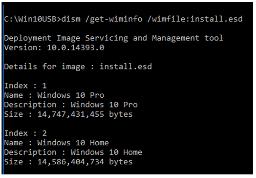
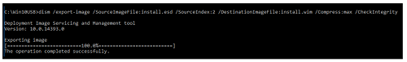

# Capture Wim image from OS

Convert files from Electronic Software Delivery (ESD) form to Windows Imaging Format _(WIM_) if you need to add updated device drivers.

**How to convert files:**

Windows image files may be in the form of an ESD. Files must be WIM to make updates to drivers. Use the Deployment Image Servicing and Management\* (DISM) tool from Microsoft to update image files.

To convert the image files, follow the steps below:

_**Note: Always back up all files before following the process below.**_

1\)Create a folder (ex c:\Win10USB).&#x20;

2\)Go to the sources directory on your installation media. \
\
3\) Copy the install.esd file to the Win10USB folder.&#x20;

4\) Open Command Prompt as Administrator (Windows Key + X -> Command Prompt (Admin)).&#x20;

5\) Change directory to the working directory (cd c:\Win10USB).&#x20;

6\) Show the available images within the install.esd file.&#x20;

#### &#x20;         dism /Get-WimInfo /WimFile:install.esd

7\) Determine the Index number to modify (in this example we are modifying Index 2)&#x20;

8\) Export the image to a WIM file.&#x20;

**dism /export-image /SourceImageFile:install.esd /SourceIndex:2 /DestinationImageFile:install.wim /Compress:max /CheckIntegrity**

You now have an install.wim file alongside the install.esd.

_**Note If more versions of the OS need to be exported, simply repeat Step 7 changing the corresponding SourceIndex and it will be added.**_

9\) Backup the original install.esd and then replace on your installation media with the new install.wim
